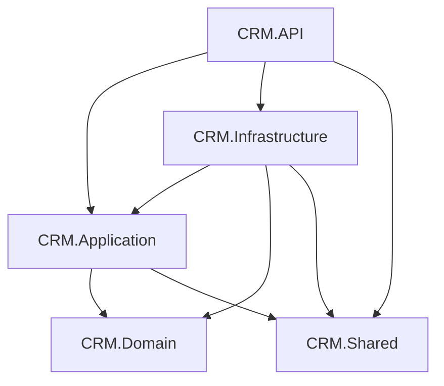
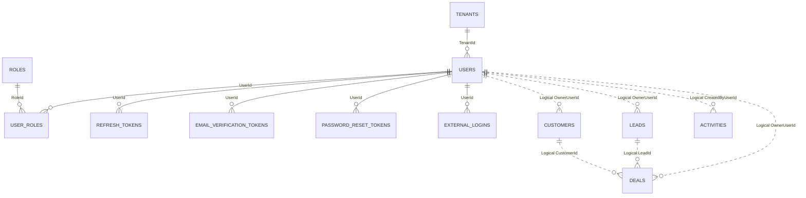
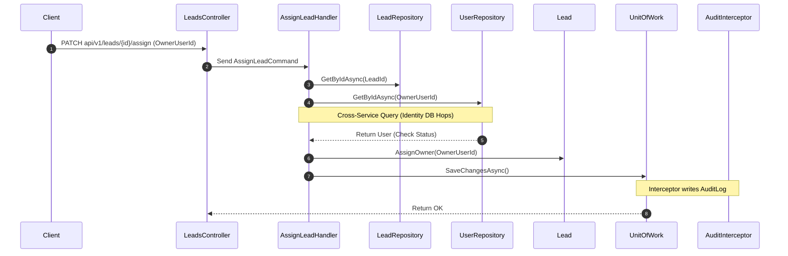
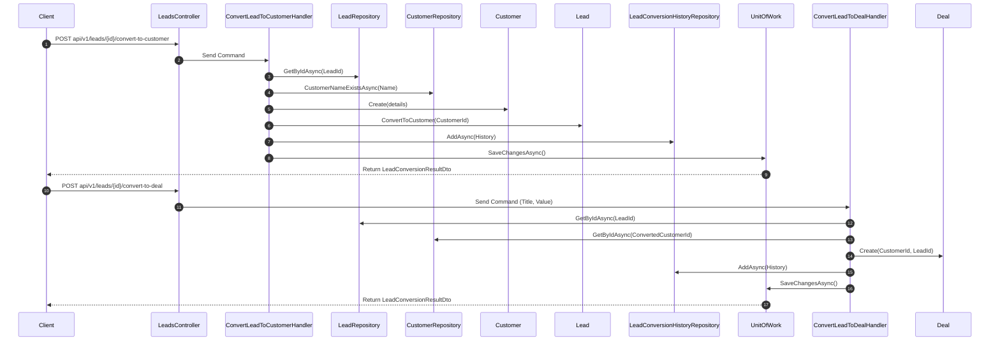
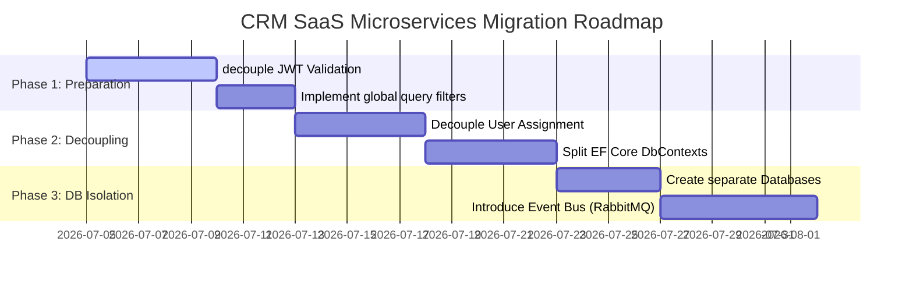

# Architecture Assessment: Microservices Readiness Report
**Project Name:** CRM SaaS System  
**Prepared by:** Senior Backend Architect  
**Target Audience:** Engineering Leadership & Senior Architects  

---

## 1. Executive Summary

This assessment report evaluates the readiness of the current multi-tenant SaaS CRM system for migration from a monolithic Clean Architecture design to a distributed microservices architecture. 

Based on a detailed analysis of the .NET 8 codebase, the system is exceptionally well-structured, clean, and respects Clean Architecture boundaries at the project reference level. It already utilizes asynchronous MediatR commands/queries, FluentValidation, and has clearly defined repository abstractions.

However, several runtime, database, and logic couplings must be resolved before extracting services:
1. **JWT Verification Database Hops:** The authentication system requires querying the database on every authenticated API request to validate token version and lockout status.
2. **Synchronous Validation Dependency:** The lead assignment workflow requires querying the `Users` table in the Identity module.
3. **Shared Database & Migrations:** All tables reside in a single database schema (`AppDbContext`), sharing transaction boundaries and an EF Core change tracking interceptor for auditing.

**Recommendation:** A phased, incremental migration path is highly recommended over a "big-bang" rewrite. We should start by decoupling JWT validation, removing synchronous cross-service DB queries, and then splitting the databases, followed by containerization and asynchronous messaging.

---

## 2. Current Architecture

The backend consists of five projects, strictly following Clean Architecture:

* **CRM.Domain:** The core layer containing domain entities, enums, value objects, domain exceptions, and specifications. It has zero external dependencies or project references.
* **CRM.Application:** Contains the application logic, CQRS handlers (MediatR), request models, and DTOs. It depends only on `CRM.Domain` and `CRM.Shared`.
* **CRM.Infrastructure:** Implements database persistence via Entity Framework Core, repositories, JWT token generation, email services, and Google OAuth services. It depends on `CRM.Application`, `CRM.Domain`, and `CRM.Shared`.
* **CRM.API:** The ASP.NET Core presentation layer exposing REST endpoints, defining rate limiting policies, and setting up dependency injection and middleware pipelines. It depends on all other projects.
* **CRM.Shared:** Contains shared contracts, cross-cutting constants, custom exceptions, audit event definitions, and utility helpers. It has zero project references.

### Main Technologies & Frameworks
* **Framework:** .NET 8 Web API
* **Database Access:** Entity Framework Core 8 (SQL Server)
* **Design Patterns:** CQRS (MediatR), Repository Pattern, Unit of Work, SaveChanges Interceptor
* **Authentication:** JWT Bearer tokens, ASP.NET Core Policy-based auth placeholder, Google OAuth 2.0 (`Google.Apis.Auth`)
* **Logging & Telemetry:** Serilog (Console & File sinks), Correlation IDs
* **Validation:** FluentValidation

---

## 3. Solution Dependency Map



---

## 4. Module Inventory

Based on the actual code, the solution implements two fully operational modules, one cross-cutting concern, and leaves one module as a planned placeholder:

### 1. Identity Module (Fully Implemented)
* **Purpose:** Handles multi-tenant organization onboarding, user registration, email verification, password reset, token-based session tracking, and Google OAuth registration.
* **API Endpoints:** `api/v1/auth/*` (`AuthController.cs`)
* **Entities:** `Tenant`, `User`, `Role`, `UserRole`, `RefreshToken`, `EmailVerificationToken`, `PasswordResetToken`, `ExternalLogin`
* **Repositories:** `ITenantRepository`, `IUserRepository`, `IRoleRepository`, `IUserRoleRepository`, `IRefreshTokenRepository`, `IEmailVerificationTokenRepository`, `IPasswordResetTokenRepository`, `IExternalLoginRepository`
* **Infrastructure Services:** `JwtService`, `RefreshTokenService`, `GoogleAuthService`, `SmtpEmailService`, `BcryptPasswordHasher`
* **DB Tables:** `Tenants`, `Users`, `Roles`, `UserRoles`, `RefreshTokens`, `EmailVerificationTokens`, `PasswordResetTokens`, `ExternalLogins`

### 2. CRM Core Module (Fully Implemented)
* **Purpose:** Manages leads, customers, deals, activities, and transition logs.
* **API Endpoints:**
  * `api/v1/leads/*` (`LeadsController.cs`)
  * `api/v1/customers/*` (`CustomersController.cs`)
  * `api/v1/deals/*` (`DealsController.cs`)
  * `api/v1/activities/*` (`ActivitiesController.cs`)
* **Entities:** `Lead`, `Customer`, `Deal`, `Activity`, `LeadConversionHistory`
* **Repositories:** `ILeadRepository`, `ICustomerRepository`, `IDealRepository`, `IActivityRepository`, `ILeadConversionHistoryRepository`
* **DB Tables:** `Leads`, `Customers`, `Deals`, `Activities`, `LeadConversionHistories`

### 3. Audit Module (Fully Implemented - Cross-Cutting)
* **Purpose:** Intercepts EF Core operations on entities implementing `IAuditable` and records structural audit changes.
* **Entities:** `AuditLog`
* **Infrastructure Services:** `AuditInterceptor`, `AuditService`
* **DB Tables:** `AuditLogs`

### 4. Analytics Module (Planned / Not Implemented)
* **Status:** Contains empty directories (`CRM.Application/Analytics/Queries`, etc.). No logical code or database tables are implemented.

---

## 5. Database Ownership Map

The monolithic SQL Server database uses a single DbContext (`AppDbContext.cs`). The physical layout maps as follows:

| Table/Entity Name | Primary Key | Tenant Ownership | Foreign Keys | Navigation Relationships | Soft-Delete | RowVersion / Concurrency | Audit Fields | Owning Module |
| :--- | :--- | :--- | :--- | :--- | :--- | :--- | :--- | :--- |
| **Tenants** | `Id` | Self (Id) | None | None | No | Yes | CreatedAtUtc, UpdatedAtUtc | Identity |
| **Users** | `Id` | Yes (`TenantId`) | `TenantId` -> Tenants | UserRoles, Tokens | No | Yes | CreatedAtUtc, UpdatedAtUtc | Identity |
| **Roles** | `Id` | Yes (`TenantId`) | None | UserRoles | No | Yes | CreatedAtUtc, UpdatedAtUtc | Identity |
| **UserRoles** | `Id` | Yes (`TenantId`) | `UserId` -> Users, `RoleId` -> Roles | User, Role | No | No | None | Identity |
| **RefreshTokens** | `Id` | Yes (`TenantId`) | `UserId` -> Users | None | No | Yes | CreatedAtUtc, UpdatedAtUtc | Identity |
| **EmailVerificationTokens** | `Id` | Yes (`TenantId`) | `UserId` -> Users | None | No | Yes | CreatedAtUtc, UpdatedAtUtc | Identity |
| **PasswordResetTokens** | `Id` | Yes (`TenantId`) | `UserId` -> Users | None | No | Yes | CreatedAtUtc, UpdatedAtUtc | Identity |
| **ExternalLogins** | `Id` | Yes (`TenantId`) | `UserId` -> Users | None | No | Yes | CreatedAtUtc, UpdatedAtUtc | Identity |
| **Customers** | `Id` | Yes (`TenantId`) | None | None | Yes (`IsDeleted`) | Yes | CreatedAtUtc, UpdatedAtUtc | CRM Core |
| **Leads** | `Id` | Yes (`TenantId`) | None | None | Yes (`IsDeleted`) | Yes | CreatedAtUtc, UpdatedAtUtc | CRM Core |
| **Deals** | `Id` | Yes (`TenantId`) | None | None | Yes (`IsDeleted`) | Yes | CreatedAtUtc, UpdatedAtUtc | CRM Core |
| **Activities** | `Id` | Yes (`TenantId`) | None | None | Yes (`IsDeleted`) | Yes | CreatedAtUtc, UpdatedAtUtc | CRM Core |
| **LeadConversionHistories** | `Id` | Yes (`TenantId`) | None | None | No | Yes | CreatedAtUtc, UpdatedAtUtc | CRM Core |
| **AuditLogs** | `Id` | Yes (`TenantId`) | None | None | No | No | CreatedAtUtc | Audit |

> [!IMPORTANT]
> **Database Foreign Keys Architecture:**
> There are **no physical SQL foreign keys** configured in the migrations or EF configuration between CRM tables (`Leads`, `Customers`, `Deals`, `Activities`) and Identity tables (`Users`, `Tenants`).
> Logical relations exist (e.g., `Leads.OwnerUserId` maps to a user ID), but the database does not enforce referential integrity across these boundaries. This simplifies database isolation because there are no physical constraints to drop.

---

## 6. Current ER Diagram



---

## 7. Runtime Dependency Matrix

| Source Module | Target Module | Source Class/Method | Dependency Type | Reason / Details | Migration Difficulty |
| :--- | :--- | :--- | :--- | :--- | :--- |
| **CRM Core (Leads)** | **Identity** | `AssignLeadHandler.Handle` | Interface (`IUserRepository`) | Validates that the assigned user exists and is not disabled before saving. | **Medium** |
| **CRM Core (All)** | **Identity** | `AuthenticationExtensions.OnTokenValidated` | Direct Database Query | Performs a lookup in the `Users` table on every authenticated API request to confirm user status. | **High** |
| **CRM Core (All)** | **Identity** | `CurrentUser.UserId / TenantId` | Claims Principal Access | The current context claims are parsed from the JWT in `CRM.Infrastructure/Identity/CurrentUser.cs`. | **Low** |
| **CRM Core (All)** | **Audit** | `AuditInterceptor.SavingChangesAsync` | EF Change Tracker | Uses the shared `AppDbContext` to capture changed properties and write to `AuditLogs`. | **High** |

---

## 8. Critical Business Workflows

### 1. Lead Assignment
Validates target user availability through `IUserRepository` (Identity) and writes to `Leads` (CRM).



### 2. Lead Conversion to Customer & Deal
Lead conversion is fully implemented across two separate HTTP requests:
1. **Convert to Customer:** Creates a new Customer record from the Lead details, sets `Lead.Status = Converted`, links the `ConvertedCustomerId`, and creates a `LeadConversionHistory` record.
2. **Convert to Deal:** Creates a Deal linked to the newly created Customer ID, writes a second `LeadConversionHistory` record.



---

## 9. Authentication, Authorization, and Multi-Tenancy

### Claims Issued
JWTs contain the following claims:
* `sub` (User ID)
* `tenantId` (Tenant ID)
* `sessionId` (Session ID / refresh token family)
* `ver` (Token version for user security status tracking)
* `role` (Assigned roles, e.g. "Owner")

### Token Validation & Independent Service Execution
* **Can CRM Core validate tokens independently?**  
  No. While cryptographic signature checks (`IssuerSigningKey`) are performed in-memory, the `OnTokenValidated` handler makes a database query on the `Users` table on every request.
* **Does CRM Core require DB access to Users or Tenants?**  
  Yes, to check user existence, tenant correlation, and `TokenVersion` (session revocation).
* **Tenant Isolation Risks:**  
  The system **does not use EF Core global query filters for TenantId**. Isolation is manually enforced in queries (e.g. `x.TenantId == tenantId`). This presents a high risk of query-based data leakage if developers omit the filter in future queries.

---

## 10. Audit System Assessment

* **How records are created:** Automatically via `AuditInterceptor` (runs inside EF Core `SavingChangesAsync` on entities implementing `IAuditable`) and manually via `IAuditService.LogAsync` for user sessions.
* **Audited entities:** `Lead`, `Customer`, `Deal`, `Activity`. (Identity entities are not auditable via interceptor).
* **Transaction Coupling:** Automatically saved inside the business entity's database transaction.
* **Impact of database splitting:** Since `AuditLogs` and audited entities are in the same database context (`AppDbContext`), splitting databases will immediately break the interceptor if it attempts to write to a distant `AuditLogs` table.
* **Recommendation:** Keep audit tables local to each database. When Identity is split, it should write to its own log table (or omit it if not auditing Identity entities). CRM Core should retain a local `AuditLogs` table.

---

## 11. Proposed Service Boundaries

```
+------------------------------------+      +------------------------------------+
|          Identity Service          |      |         CRM Core Service           |
|                                    |      |                                    |
|  - Tenants                         |      |  - Customers                       |
|  - Users                           |      |  - Leads                           |
|  - Roles & UserRoles               |      |  - Deals                           |
|  - Auth & RefreshTokens            |      |  - Activities                      |
|  - Email/Password reset tokens     |      |  - Conversion Histories            |
+------------------+-----------------+      +-----------------+------------------+
                   |                                          |
                   | Database Isolation                       | Database Isolation
                   v                                          v
+------------------+-----------------+      +-----------------+------------------+
|             IdentityDB             |      |              CRM_DB                |
|  (Tenants, Users, Auth tables)     |      |  (Leads, Customers, Deals, etc.)   |
+------------------------------------+      +------------------------------------+
```

---

## 12. Cross-Service Communication Matrix

| Source Service | Target Service | Interaction Type | Future Implementation | Reason / Details |
| :--- | :--- | :--- | :--- | :--- |
| **CRM Core** | **Identity** | Token Validation | Local Crypto Validation | Remove database checking. Cryptographically validate JWTs at CRM Core using public keys. Session revocation checks can be cached in Redis or managed via backchannel logs. |
| **CRM Core** | **Identity** | Assign Lead | Asynchronous Events + Local Read Model | Keep user records cached in a local `Users` read model in CRM Core database. When a user is created/disabled in Identity, broadcast a `UserCreated` / `UserStatusChanged` integration event via RabbitMQ to update the local cache. |

---

## 13. Migration Risks

> [!CAUTION]
> **Risk 1: JWT Verification Database Hops (Critical)**
> * *Evidence:* `AuthenticationExtensions.cs:L102-113` runs a SQL query on the `Users` table on every API request.
> * *Impact:* If Identity database is split, CRM Core API requests will fail during JWT validation unless database dependencies are removed.
> * *Mitigation:* Decouple JWT validation. Implement stateless JWT checks in CRM Core and cache validation/revocation flags in memory or Redis.

> [!WARNING]
> **Risk 2: Synchronous Lead Assignment (High)**
> * *Evidence:* `AssignLeadHandler.cs:L48-63` calls `IUserRepository.GetByIdAsync` synchronously.
> * *Impact:* Extraction breaks this command handler immediately.
> * *Mitigation:* Create a local `Users` read-model in the CRM database, updated asynchronously via message bus events.

> [!WARNING]
> **Risk 3: Shared Database Transactions & Shared Interceptor (High)**
> * *Evidence:* `UnitOfWork` saves all changes, and `AuditInterceptor` writes to a shared `AuditLogs` table.
> * *Impact:* Splitting the database violates local transactions and halts write actions.
> * *Mitigation:* Split the database. Let each service write audits locally to its own database.

---

## 14. Recommended Migration Roadmap



### Phase 1: Architecture Cleanup & Boundary Preparation
* **Goal:** Enable CRM Core to validate JWTs in isolation. Enforce tenant isolation globally.
* **Changes:** 
  * Modify `AuthenticationExtensions.cs` to remove the database read from `Users` table in the token validator. Rely purely on cryptographic signature check and token expiration.
  * Configure EF Core global query filters on `TenantId` for all CRM entities in their configurations (`LeadConfiguration`, `CustomerConfiguration`, `DealConfiguration`, `ActivityConfiguration`).

### Phase 2: Application Decoupling
* **Goal:** Eliminate synchronous queries from CRM Core into Identity domain entities.
* **Changes:**
  * Add a simplified `Users` and `Tenants` table/entity in CRM Core domain as a Read Model.
  * Update `AssignLeadHandler` to query the local CRM Core `Users` read model.

### Phase 3: Database Isolation & Split
* **Goal:** Physically segregate databases.
* **Changes:**
  * Create `IdentityDbContext` and `CrmDbContext`.
  * Separate connection strings.
  * Generate separate migrations for each schema.

### Phase 4: Eventing & Eventual Consistency
* **Goal:** Synchronize tenant and user changes across boundaries.
* **Changes:**
  * Configure RabbitMQ.
  * Broadcast `UserCreated`, `UserStatusChanged`, `TenantCreated` integration events from Identity.
  * Consume events in CRM Core to keep local read models in sync.

---

## 15. Phase 1 Action Plan

1. **Step 1: Cryptographic JWT Validation:**
   * Modify `AddJwtAuthentication` in [AuthenticationExtensions.cs](file:///c:/Users/dhanu/source/repos/CRM/backend/CRM.API/Extensions/AuthenticationExtensions.cs).
   * Delete lines 85–114 (the database validation logic) and replace with a stateless validation check or introduce Redis session checks.
2. **Step 2: Add Global Query Filters:**
   * Modify all EF configuration files to inject `ICurrentUser` or dynamically read `TenantId` from the context accessor to automatically filter all DB reads.

---

## 16. Questions Requiring Architect Decision

1. **Session Revocation Strategy:** Do we rely purely on short JWT lifespans (e.g. 5-15 mins) and accept that a revoked user can access CRM Core until token expiration, or do we implement a distributed session revocation cache (e.g. Redis backchannel) accessed by CRM Core?
2. **User Cache Ownership:** Do we want a simplified local read-only table for Users in the CRM database, or do we want to retrieve user details dynamically via a fast synchronous communication layer (e.g., gRPC) with caching?
3. **Audit Storage Partitioning:** Should the Audit logs be partitioned per database (local write schemas) or should we introduce a central Audit microservice from day one to consume log messages asynchronously?

---

## Summary Tables

### Table A — Service Ownership

| Current Module/Entity | Current Location | Proposed Service | Reason | Migration Difficulty |
| :--- | :--- | :--- | :--- | :--- |
| **Tenants** | CRM.Domain/Entities/Tenant.cs | Identity | Core identity and billing unit. | Low |
| **Users** | CRM.Domain/Entities/User.cs | Identity | Auth management resource. | Low |
| **Roles & UserRoles** | CRM.Domain/Entities/Role.cs | Identity | Access management rules. | Low |
| **Customers** | CRM.Domain/Entities/Customer.cs | CRM Core | Part of core customer relationship. | Low |
| **Leads** | CRM.Domain/Entities/Lead.cs | CRM Core | Part of sales pipeline workflow. | Low |
| **Deals** | CRM.Domain/Entities/Deal.cs | CRM Core | Sales values and stage management. | Low |
| **Activities** | CRM.Domain/Entities/Activity.cs | CRM Core | Inter-customer logging utility. | Low |
| **AuditLogs** | CRM.Domain/Entities/AuditLog.cs | Shared / Local | Keep local to each service db to avoid distributed writes. | Medium |

### Table B — Cross-Boundary Dependencies

| Source | Target | Current Dependency | Future Communication | Difficulty |
| :--- | :--- | :--- | :--- | :--- |
| **CRM Core (Leads)** | **Identity** | Direct DB check of user lockout / registration. | Cryptographic verification of JWT. | High |
| **CRM Core (AssignLead)** | **Identity** | Direct query to `IUserRepository` to check user status. | Eventual consistency via local read model (User cache). | Medium |

### Table C — Migration Priority

| Priority | Change | Reason | Risk if Delayed |
| :--- | :--- | :--- | :--- |
| **1 (Critical)** | Decouple JWT validation database reads | Token validation blocks physical microservice isolation. | Immediate extraction failure. |
| **2 (High)** | Implement local User/Tenant Read Models in CRM | Solves synchronous cross-service DB queries. | Service boundary breakdown. |
| **3 (High)** | Split DbContext and migrations | Segregates persistence layers. | Shared data transaction failures. |
| **4 (Medium)** | RabbitMQ integration events | Synchronizes local data cache eventually. | Data state inconsistency. |
| **5 (Low)** | API Gateway and containerization | Simplifies consumer integrations and deployment. | Deployment complexity. |
