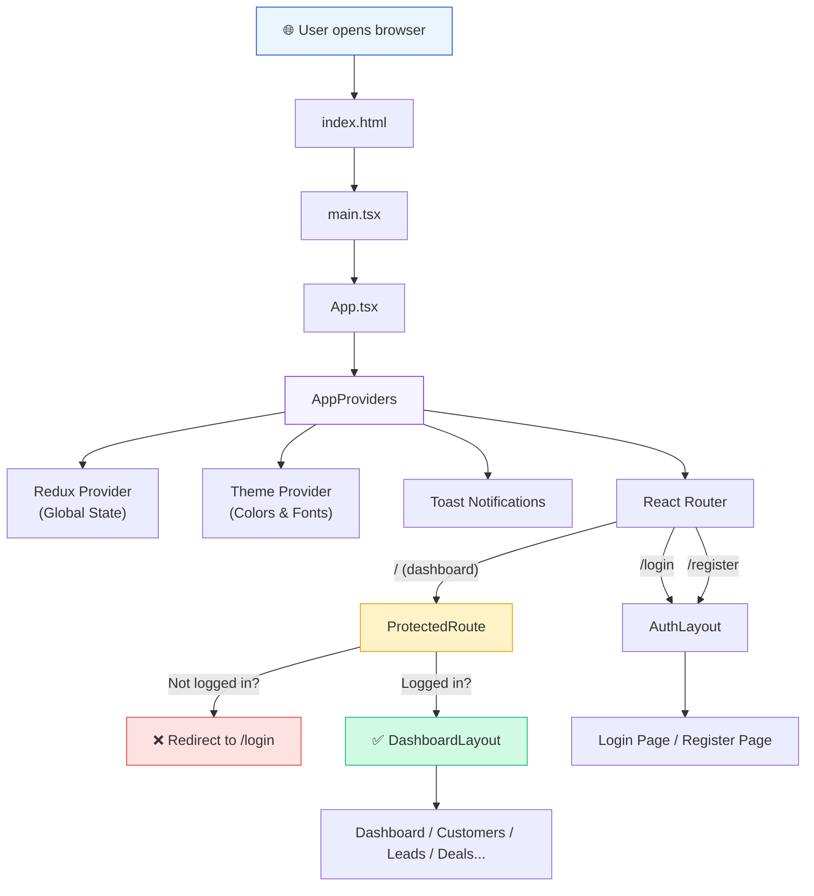
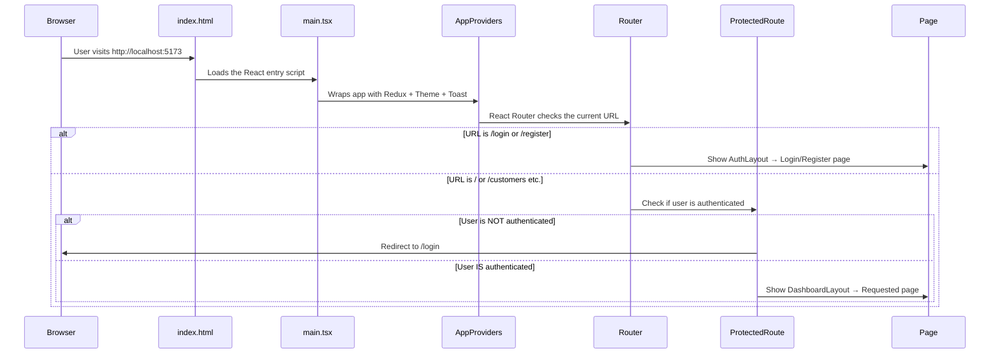

# 🏗️ Frontend Architecture Overview

> **Purpose**: This note explains **what** we built, **why** we built it this way, and **how** all the pieces connect together. Think of this as the **map** of our entire frontend system.

---

## 🤔 What is "Architecture"?

Architecture is simply **how you organize your code files and folders**. Just like a building has rooms for different purposes (kitchen for cooking, bedroom for sleeping), our app has folders for different responsibilities.

A **bad architecture** = throwing all files in one folder. Works for small apps, becomes a nightmare when the app grows.

A **good architecture** = organized folders where every file has a clear home. Easy to find things, easy to add new features, easy for teams to work together.

---

## 🗂️ The Folder Structure (Our Blueprint)

Here is our complete folder structure and what each folder does:

```
frontend/
│
├── src/                          ← All our source code lives here
│   │
│   ├── app/                      ← 🧠 The "Brain" of the app
│   │   ├── store.ts              ← Central memory (Redux Store)
│   │   ├── router.tsx            ← Navigation map (which URL = which page)
│   │   ├── providers/            ← Global wrappers (theme, state, toasts)
│   │   └── layouts/              ← Page shells (sidebar, header, footer)
│   │
│   ├── shared/                   ← 🔧 Reusable tools (used everywhere)
│   │   ├── components/           ← Generic UI pieces (buttons, modals)
│   │   ├── hooks/                ← Custom React hooks
│   │   ├── utils/                ← Helper functions
│   │   ├── services/             ← API connection layer (baseApi.ts)
│   │   ├── types/                ← Shared TypeScript types
│   │   └── validations/          ← Shared form validation schemas
│   │
│   ├── features/                 ← 📦 Business modules (one per domain)
│   │   ├── auth/                 ← Login, logout, tokens, sessions
│   │   ├── customers/            ← Customer management
│   │   ├── leads/                ← Lead pipeline tracking
│   │   ├── deals/                ← Revenue opportunity tracking
│   │   ├── activities/           ← Tasks, calls, emails
│   │   ├── analytics/            ← Reports and charts
│   │   └── ai/                   ← AI predictions & insights
│   │
│   ├── styles/                   ← 🎨 Design system (colors, fonts)
│   │   └── theme.ts              ← Material UI theme config
│   │
│   ├── main.tsx                  ← 🚀 Entry point (app starts here)
│   └── App.tsx                   ← Root component (assembles everything)
│
├── .env.development              ← Dev environment variables
├── .env.production               ← Production environment variables
├── vite.config.ts                ← Build tool configuration
└── package.json                  ← List of installed packages
```

---

## 🧩 How the Pieces Connect

This is the most important diagram. It shows how data flows from the moment a user opens the app to the moment they see a page:



### Reading the diagram:

1. **User opens browser** → Browser loads `index.html`
2. `index.html` loads `main.tsx` → This is the **entry door** of our React app
3. `main.tsx` renders `App.tsx` → This is the **root component**
4. `App.tsx` wraps everything inside `AppProviders` → This gives the entire app access to:
   - **Redux** (global state/memory)
   - **Material UI Theme** (consistent colors and fonts)
   - **Toast notifications** (popup messages)
5. Inside that, **React Router** decides which page to show based on the URL
6. If the URL is `/login` or `/register` → show the **AuthLayout** (centered card design)
7. If the URL is `/` (dashboard) or `/customers` etc → first check **ProtectedRoute**
   - Not logged in? → **Redirect to login**
   - Logged in? → Show the **DashboardLayout** with sidebar and content

---

## 📁 The Three Main Zones

Our code is split into **three zones**. Each zone has a clear rule about what goes inside it:

```mermaid
flowchart LR
    subgraph APP["🧠 app/"]
        direction TB
        A1["store.ts"]
        A2["router.tsx"]
        A3["providers/"]
        A4["layouts/"]
    end

    subgraph SHARED["🔧 shared/"]
        direction TB
        S1["services/baseApi.ts"]
        S2["components/"]
        S3["hooks/"]
        S4["utils/"]
    end

    subgraph FEATURES["📦 features/"]
        direction TB
        F1["auth/"]
        F2["customers/"]
        F3["leads/"]
        F4["deals/"]
    end

    APP --- SHARED
    SHARED --- FEATURES

    style APP fill:#EBF5FF,stroke:#1A56DB
    style SHARED fill:#F5F3FF,stroke:#7C3AED
    style FEATURES fill:#D1FAE5,stroke:#10B981
```



### Zone Rules:

| Zone | Contains | Rule |
|------|----------|------|
| **`app/`** | Store, Router, Providers, Layouts | Only **one-time global setup** files. You rarely touch this folder after initial setup. |
| **`shared/`** | baseApi, reusable components, hooks, utils | Only things that are **used by 2 or more features**. If only one feature uses it, it belongs in that feature folder. |
| **`features/`** | auth, customers, leads, deals, etc. | Each feature is a **self-contained mini-app**. It has its own pages, components, API calls, types, and state. |

### The Golden Rule:

> **Features can import from `shared/`**, but **features should NEVER import from other features**.
>
> If two features need the same thing, move it to `shared/`.

This rule keeps features independent. You can delete an entire feature folder and nothing else breaks.

---

## 📄 Key Files Explained (One-liner each)

| File | What it does |
|------|-------------|
| `main.tsx` | The **starting point**. Mounts the React app into `index.html`. |
| `App.tsx` | The **root component**. Wraps providers and router together. |
| `app/store.ts` | Creates the **Redux store** (the app's central memory). See → [[02-Redux-State-Management]] |
| `app/router.tsx` | Defines **which URL shows which page**. Maps URLs to components. |
| `app/providers/AppProviders.tsx` | Wraps the app with **Redux, Theme, and Toast** providers. |
| `app/layouts/DashboardLayout.tsx` | The **shell** for logged-in pages (sidebar + header + content area). |
| `app/layouts/AuthLayout.tsx` | The **shell** for login/register pages (centered card on gradient background). |
| `shared/services/baseApi.ts` | The **API connection layer**. Handles auth headers and token refresh. See → [[03-RTK-Query-&-Token-Rotation]] |
| `styles/theme.ts` | The **design system**. Colors, fonts, button styles, card styles. See → [[04-UI-Theme-&-Design-System]] |
| `features/auth/store/authSlice.ts` | Stores **who is logged in** and their JWT token. See → [[01-Authentication-&-Route-Guards]] |
| `features/auth/components/ProtectedRoute.tsx` | **Guards pages** from unauthenticated users. See → [[01-Authentication-&-Route-Guards]] |

---

## 🔁 The App Lifecycle (Startup Sequence)

When a user opens the app, here is what happens step by step:



---

## 🏢 Why is This "Enterprise Grade"?

Here are the reasons this structure is used by companies like Google, Microsoft, and Stripe:

### 1. Feature Isolation
Each feature (auth, customers, leads) is a **self-contained module**. A new developer can work on `leads/` without understanding `deals/`. Teams can work in parallel without conflicts.

### 2. Scalability
Need to add a new CRM module like "Invoices"? Just create `features/invoices/` with its own pages, API, and state. Nothing else changes.

### 3. Shared Layer Prevents Duplication
Common things like the API layer, design tokens, and reusable buttons live in `shared/`. No copy-pasting code across features.

### 4. Path Aliases Keep Imports Clean
Instead of writing:
```typescript
// ❌ Ugly relative imports
import { store } from '../../../../app/store';
```
We write:
```typescript
// ✅ Clean alias imports
import { store } from '@app/store';
```

### 5. Future-Proof for Micro-Frontends
Because features are isolated, each feature folder can theoretically be extracted into its own separate app later (micro-frontend architecture). This is how large companies scale to hundreds of developers.

---

## 🔗 Related Notes

- [[01-Authentication-&-Route-Guards]] — How login, logout, and page protection works
- [[02-Redux-State-Management]] — How the store remembers things across pages
- [[03-RTK-Query-&-Token-Rotation]] — How data flows between frontend and backend API
- [[04-UI-Theme-&-Design-System]] — How colors, fonts, and component styles are managed

---

## 📊 Technology Stack Quick Reference

| Technology | Purpose | Why we chose it |
|-----------|---------|----------------|
| **React** | UI Library | Most popular, huge ecosystem, component-based |
| **TypeScript** | Type Safety | Catches bugs before they reach users |
| **Vite** | Build Tool | 10x faster than Webpack, instant hot reload |
| **Redux Toolkit** | State Management | Industry standard for complex apps |
| **RTK Query** | Data Fetching | Built into Redux, automatic caching |
| **React Router v7** | Navigation | Most popular React routing library |
| **Material UI** | UI Components | Google's design system, 1000+ ready components |
| **React Hook Form** | Form Handling | High performance, minimal re-renders |
| **Zod** | Validation | TypeScript-first schema validation |
| **React Hot Toast** | Notifications | Lightweight, beautiful toast popups |

---

> **Next**: Start with [[01-Authentication-&-Route-Guards]] to understand how the app stays secure. 🔐
