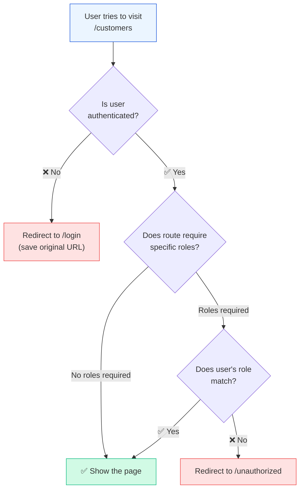
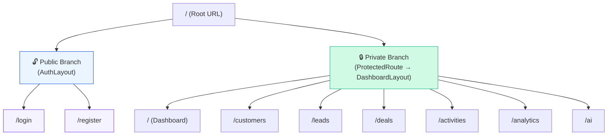
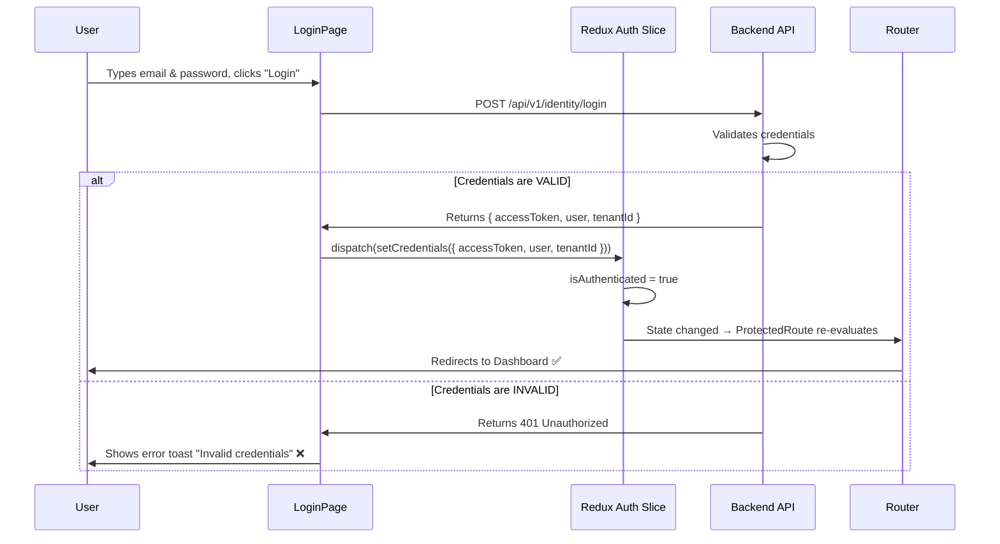

# 🔐 Authentication & Route Guards

> **Purpose**: This note explains **how our app keeps pages secure** — how it knows who is logged in, where it stores that information, and how it blocks unauthenticated users from accessing private pages.

---

## 🤔 What Problem Are We Solving?

Imagine a CRM dashboard with customer data, revenue numbers, and AI insights. You **cannot** let random people see this. We need:

1. A way to **remember** that a user is logged in (even across page refreshes)
2. A way to **block** private pages if the user is not logged in
3. A way to **redirect** them to the login page automatically
4. A way to **check roles** (e.g., only Admins can see certain pages)

---

## 🧠 The Auth Slice — Our App's Memory of "Who is Logged In"

**File**: `features/auth/store/authSlice.ts`

The **Auth Slice** is a small piece of Redux state that remembers:

```
┌──────────────────────────────────┐
│          Auth State              │
│──────────────────────────────────│
│  user: {                         │
│    id: "abc-123"                 │
│    email: "dhanush@company.com"  │
│    fullName: "Dhanush"           │
│    role: "Admin"                 │
│  }                               │
│  accessToken: "eyJhbG..."       │
│  tenantId: "tenant-456"         │
│  isAuthenticated: true           │
└──────────────────────────────────┘
```

### Key Concepts:

| Field | What it stores | Why we need it |
|-------|---------------|----------------|
| `user` | The logged-in person's info (name, email, role) | To display "Hello, Dhanush" and check permissions |
| `accessToken` | A JWT token string | Sent with every API request to prove identity. See → [[03-RTK-Query-&-Token-Rotation]] |
| `tenantId` | The organization/company ID | Our app is multi-tenant — multiple companies share the same app but see only their own data |
| `isAuthenticated` | `true` or `false` | The simplest check — "is someone logged in right now?" |

---

## 🔑 What is a JWT Token?

JWT stands for **JSON Web Token**. Think of it like a **digital ID card**:

```mermaid
flowchart LR
    A["🧑 User logs in<br/>with email & password"] --> B["🖥️ Backend verifies<br/>credentials"]
    B --> C["✅ Backend creates<br/>a JWT token"]
    C --> D["📨 Sends token<br/>to frontend"]
    D --> E["💾 Frontend stores<br/>token in Redux"]
    E --> F["📡 Every API call<br/>includes this token"]
    F --> G["🖥️ Backend reads token<br/>and knows WHO is asking"]

    style A fill:#EBF5FF,stroke:#1A56DB
    style C fill:#D1FAE5,stroke:#10B981
    style E fill:#F5F3FF,stroke:#7C3AED
    style G fill:#FEF3C7,stroke:#F59E0B
```



### Simple analogy:

> 🏨 **Hotel analogy**: When you check into a hotel, they give you a **key card**. You don't show your passport at every door — you just swipe the card. The JWT token is your key card. The backend gave it to you after verifying your identity, and now you show it with every request.

---

## ⚙️ The Auth Slice Code — Line by Line

Here is the actual code with explanations:

```typescript
// We import tools from Redux Toolkit
import { createSlice } from '@reduxjs/toolkit';
import type { PayloadAction } from '@reduxjs/toolkit';

// 👤 Define the shape of a User object
export interface User {
  id: string;
  email: string;
  fullName: string;
  role: string;        // "Admin", "Manager", "SalesRep", etc.
}

// 📦 Define what our auth state looks like
interface AuthState {
  user: User | null;           // null = nobody logged in
  accessToken: string | null;  // null = no token
  tenantId: string | null;     // null = no tenant selected
  isAuthenticated: boolean;    // simple true/false flag
}

// 🏁 Starting state (when the app first loads, nobody is logged in)
const initialState: AuthState = {
  user: null,
  accessToken: null,
  tenantId: null,
  isAuthenticated: false,
};
```

### The two actions (things that can change the state):

```typescript
const authSlice = createSlice({
  name: 'auth',
  initialState,
  reducers: {
    // ✅ ACTION 1: "setCredentials" — Called after successful login
    setCredentials: (state, action: PayloadAction<{...}>) => {
      state.accessToken = action.payload.accessToken;
      state.isAuthenticated = true;
      // Optionally set user and tenant info
    },

    // 🚪 ACTION 2: "logout" — Called when user clicks logout
    logout: (state) => {
      state.user = null;
      state.accessToken = null;
      state.tenantId = null;
      state.isAuthenticated = false;
      // Everything resets to initial state
    },
  },
});
```

### How state changes over time:

```mermaid
stateDiagram-v2
    [*] --> NotLoggedIn : App starts

    NotLoggedIn --> LoggedIn : setCredentials()
    LoggedIn --> NotLoggedIn : logout()

    state NotLoggedIn {
        note right of NotLoggedIn
            user = null
            accessToken = null
            isAuthenticated = false
        end note
    }

    state LoggedIn {
        note right of LoggedIn
            user = { name: "Dhanush", ... }
            accessToken = "eyJhbG..."
            isAuthenticated = true
        end note
    }
```

---

## 🛡️ The ProtectedRoute — Our Security Guard

**File**: `features/auth/components/ProtectedRoute.tsx`

The `ProtectedRoute` component is like a **security guard** standing at the door of every private page. Before letting you in, it checks two things:

1. **Are you authenticated?** (Do you have a valid session?)
2. **Are you authorized?** (Does your role allow access to this page?)



### The Code — Line by Line:

```typescript
export const ProtectedRoute = ({ children, allowedRoles }) => {
  // 👀 Read auth state from Redux store
  const { isAuthenticated, user } = useSelector(
    (state: RootState) => state.auth
  );

  // 📍 Get current URL (so we can redirect back after login)
  const location = useLocation();

  // 🚫 CHECK 1: Not logged in? → Go to login
  if (!isAuthenticated) {
    return <Navigate to="/login" state={{ from: location }} replace />;
    // "state={{ from: location }}" saves WHERE they were trying to go
    // So after login, we can send them back to that page!
  }

  // 🚫 CHECK 2: Wrong role? → Go to unauthorized page
  if (allowedRoles && user && !allowedRoles.includes(user.role)) {
    return <Navigate to="/unauthorized" replace />;
  }

  // ✅ All checks passed → Show the protected page
  return <>{children}</>;
};
```

---

## 🔄 How ProtectedRoute is Used in the Router

In our `router.tsx`, we wrap the entire dashboard layout with `ProtectedRoute`:

```typescript
// 🔓 PUBLIC routes — anyone can access
{
  path: '/',
  element: <AuthLayout />,     // Centered card design
  children: [
    { path: 'login', element: <LoginPage /> },
    { path: 'register', element: <RegisterPage /> },
  ],
},

// 🔒 PRIVATE routes — only authenticated users
{
  path: '/',
  element: (
    <ProtectedRoute>          // 🛡️ Guard wraps the layout
      <DashboardLayout />
    </ProtectedRoute>
  ),
  children: [
    { index: true, element: <DashboardPage /> },
    { path: 'customers', element: <CustomersPage /> },
    { path: 'leads', element: <LeadsPage /> },
    // ... more protected pages
  ],
},
```

### Visual representation of the routing tree:



---

## 🏗️ The Two Layouts

### AuthLayout (for login/register pages)

The **AuthLayout** is a simple, clean design used for unauthenticated pages:

```
┌──────────────────────────────────────────┐
│         Gradient Background              │
│                                          │
│           ┌──────────────┐               │
│           │   CRM SaaS   │               │
│           │              │               │
│           │  [Email    ] │               │
│           │  [Password ] │               │
│           │  [ Login  ]  │               │
│           └──────────────┘               │
│                                          │
└──────────────────────────────────────────┘
```

### DashboardLayout (for authenticated pages)

The **DashboardLayout** is the main workspace with a sidebar and header:

```
┌──────────┬──────────────────────────────┐
│          │  Header Bar          [👤 U]  │
│ CRMSaaS  ├──────────────────────────────┤
│          │                              │
│ Dashboard│   Page Content               │
│ Customers│   (changes per route)        │
│ Leads    │                              │
│ Deals    │   This area shows            │
│ Activities│  whatever page the           │
│ Analytics│   router selects             │
│ AI       │                              │
│          │                              │
│──────────│                              │
│ 🚪Logout │                              │
└──────────┴──────────────────────────────┘
```

The **`<Outlet />`** component inside DashboardLayout is the "hole" where React Router injects the current page content.

---

## 🔄 The Complete Login Flow

Here is the end-to-end flow of what happens when a user logs in:



---

## 🎯 Key Takeaways

| Concept | One-line Summary |
|---------|-----------------|
| **Auth Slice** | A piece of Redux memory that stores who is logged in, their token, and their tenant. |
| **setCredentials** | The action called after a successful login — saves user info and token to Redux. |
| **logout** | The action called when user logs out — clears everything back to empty. |
| **ProtectedRoute** | A wrapper component that redirects to `/login` if `isAuthenticated` is `false`. |
| **allowedRoles** | An optional prop on ProtectedRoute to restrict pages to specific user roles (e.g., Admin only). |
| **AuthLayout** | The visual shell for login/register — centered card on gradient background. |
| **DashboardLayout** | The visual shell for the main app — sidebar navigation + header + content area. |
| **`<Outlet />`** | A React Router placeholder that renders the child route's component inside a layout. |

---

## 🔗 Related Notes

- ← [[00-Architecture-Overview]] — The master map of the whole frontend
- → [[02-Redux-State-Management]] — Deeper dive into how Redux stores and updates data
- → [[03-RTK-Query-&-Token-Rotation]] — How the token is sent with API calls and refreshed silently
- → [[04-UI-Theme-&-Design-System]] — How colors and fonts are managed

---

> **Next**: Read [[02-Redux-State-Management]] to understand how Redux works as the app's central memory. 🧠
