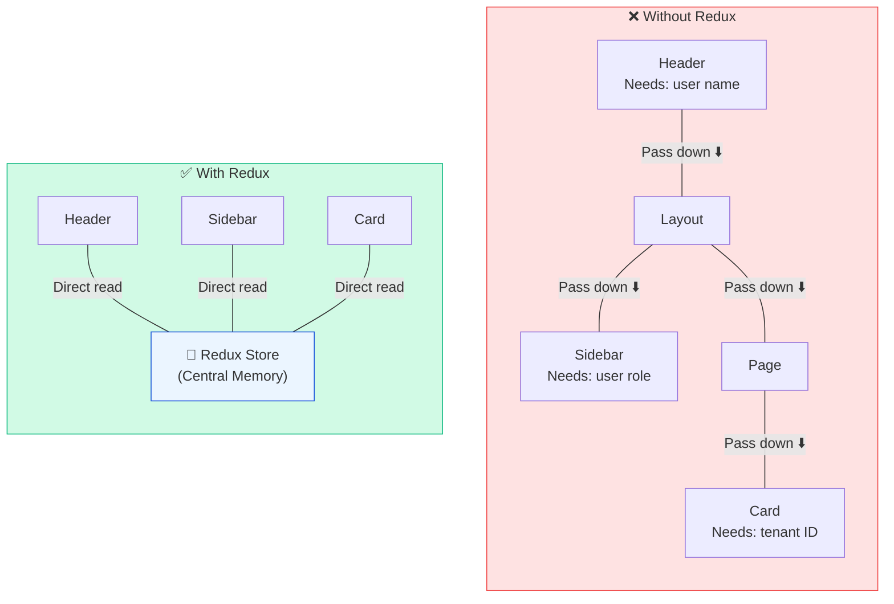
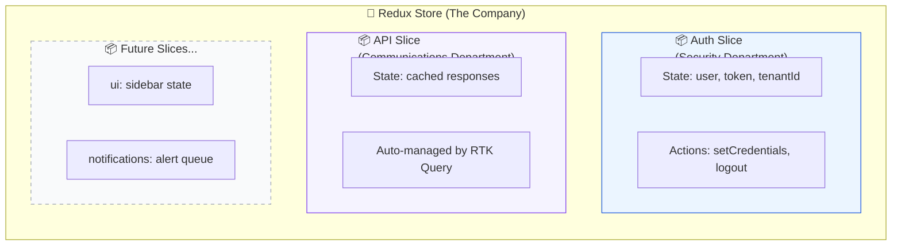
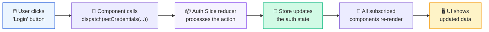
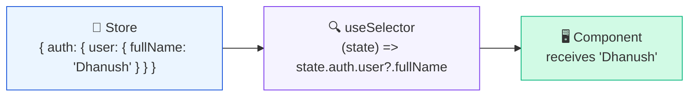
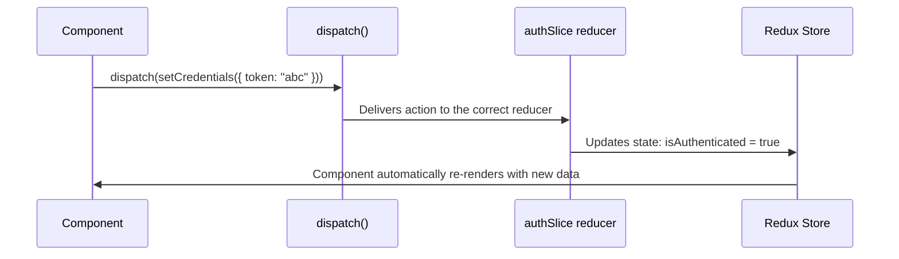
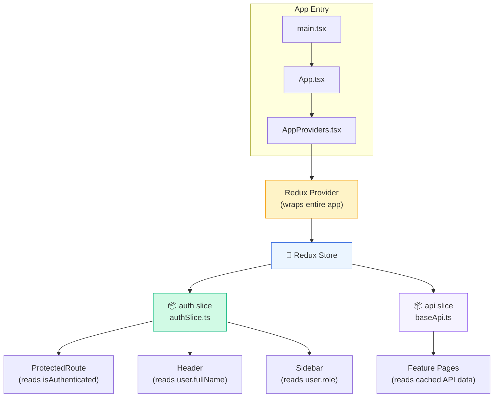

# 🧠 Redux State Management

> **Purpose**: This note explains **what Redux is**, **why we need it**, and **how our store.ts file works** — all in simple terms with visual diagrams.

---

## 🤔 The Problem: Why Do We Even Need Redux?

React components have their own memory called **"state"** (using `useState`). But here is the problem:



### Without Redux (Prop Drilling):
If the `Header` needs the user's name, you have to pass it down through **every component in between** — even if those middle components don't care about it. This is called **"prop drilling"** and it becomes a nightmare in large apps.

### With Redux (Central Store):
Any component, **anywhere** in the tree, can directly read from the store. No passing through parents. No chains. Clean and simple.

---

## 🏪 What is the Redux Store?

Think of the Redux Store as a **central database** that lives in the browser's memory while the app is running:

```
┌─────────────────────────────────────────────┐
│               🏪 REDUX STORE                │
│─────────────────────────────────────────────│
│                                             │
│  📦 auth: {                                 │
│      user: { name: "Dhanush", role: "Admin"}│
│      accessToken: "eyJhbG..."               │
│      tenantId: "tenant-456"                 │
│      isAuthenticated: true                  │
│  }                                          │
│                                             │
│  📦 api: {                                  │
│      queries: { ... }    ← cached API data  │
│      mutations: { ... }  ← pending writes   │
│  }                                          │
│                                             │
└─────────────────────────────────────────────┘
```

Right now our store has **two sections**:

| Section | What it stores | Managed by |
|---------|---------------|------------|
| `auth` | Who is logged in, their token, their tenant | `authSlice.ts` (our code) |
| `api` | Cached API responses, loading states, errors | `baseApi.ts` (RTK Query auto-manages this) |

As we add more features, we'll add more sections (e.g., a `ui` slice for sidebar open/close state).

---

## 🍰 What is a "Slice"?

A **slice** is simply a **section of the store** with its own:
- **State** — the data it holds
- **Reducers** — functions that can change that data
- **Actions** — names for those changes

Think of it like a **department** in a company:



---

## ⚙️ The store.ts File — Line by Line

**File**: `app/store.ts`

This is the file that **creates and configures** the Redux store. Let's break it down:

```typescript
import { configureStore } from '@reduxjs/toolkit';
import { baseApi } from '@shared/services/baseApi';
import authReducer from '@features/auth/store/authSlice';
```

**What's happening**: We are importing three things:
1. `configureStore` — The Redux Toolkit function that creates a store
2. `baseApi` — Our RTK Query API service (handles all HTTP calls)
3. `authReducer` — The auth slice we built (handles login state)

```typescript
export const store = configureStore({
  reducer: {
    [baseApi.reducerPath]: baseApi.reducer,  // Section 1: "api"
    auth: authReducer,                       // Section 2: "auth"
  },
  middleware: (getDefaultMiddleware) =>
    getDefaultMiddleware().concat(baseApi.middleware),
});
```

**What's happening**:

| Line | What it does |
|------|-------------|
| `reducer: { ... }` | Tells the store what sections to have. Each key becomes a top-level section in the store. |
| `[baseApi.reducerPath]: baseApi.reducer` | Creates the `api` section. RTK Query manages this automatically — caching, loading states, errors. |
| `auth: authReducer` | Creates the `auth` section. Our `authSlice.ts` manages this — user info, tokens. |
| `middleware: ...` | Adds RTK Query's middleware. This enables automatic caching, polling, and re-fetching. Think of middleware as "background workers" that process actions before they reach the store. |

```typescript
export type RootState = ReturnType<typeof store.getState>;
export type AppDispatch = typeof store.dispatch;
```

**What's happening**: These two lines create TypeScript types so that when we use the store anywhere in the app, TypeScript knows the **exact shape** of our data. This gives us autocomplete and error checking.

---

## 🔄 How Data Flows in Redux

Redux follows a strict **one-way data flow**. Data always moves in one direction:



### The three core concepts:

| Concept | Analogy | In our app |
|---------|---------|-----------|
| **Action** | A message/request | `setCredentials({ accessToken: "..." })` |
| **Reducer** | The processor that handles the message | The function inside `authSlice` that updates state |
| **Store** | The database that holds the result | `store.getState().auth` |

### Simple analogy:

> 🍔 **Restaurant analogy**:
> - **Action** = Your order slip ("I want a burger")
> - **Reducer** = The chef (reads the order, makes the food)
> - **Store** = The kitchen counter (holds the finished food)
> - **Component** = You, the customer (picks up the food and eats it)
>
> You never walk into the kitchen and cook yourself. You always go through the **order slip** (action) → **chef** (reducer) → **counter** (store).

---

## 📖 Reading from the Store

To **read** data from the store in any component, we use `useSelector`:

```typescript
import { useSelector } from 'react-redux';
import type { RootState } from '@app/store';

const MyComponent = () => {
  // 👇 Read the user's name from the auth section of the store
  const userName = useSelector((state: RootState) => state.auth.user?.fullName);

  // 👇 Check if someone is logged in
  const isLoggedIn = useSelector((state: RootState) => state.auth.isAuthenticated);

  return <h1>Hello, {userName}</h1>;
};
```

### How `useSelector` works:



Think of `useSelector` as a **magnifying glass** — you point it at the store and it extracts just the piece of data you need.

---

## ✍️ Writing to the Store

To **change** data in the store, we use `useDispatch` to send an action:

```typescript
import { useDispatch } from 'react-redux';
import { setCredentials, logout } from '@features/auth/store/authSlice';

const LoginPage = () => {
  const dispatch = useDispatch();

  const handleLogin = (response) => {
    // ✅ Send new credentials to the store
    dispatch(setCredentials({
      accessToken: response.accessToken,
      user: response.user,
      tenantId: response.tenantId,
    }));
  };

  const handleLogout = () => {
    // 🚪 Clear everything from the store
    dispatch(logout());
  };
};
```

### How `dispatch` works:



### Key rules:

> ⚠️ **You can NEVER directly modify the store**
> ```typescript
> // ❌ WRONG — Never do this
> store.getState().auth.isAuthenticated = true;
>
> // ✅ CORRECT — Always dispatch an action
> dispatch(setCredentials({ accessToken: "..." }));
> ```
> This rule ensures that every state change is **trackable**, **predictable**, and **debuggable**.

---

## 🛠️ Redux DevTools

One of the biggest advantages of Redux is the **Redux DevTools** browser extension. It lets you:

- 🔍 **Inspect** every piece of state in the store
- ⏪ **Time-travel** — go back to any previous state
- 📋 **View every action** that was dispatched (like a log of everything that happened)
- 🐛 **Debug** by replaying actions step by step

To use it:
1. Install the "Redux DevTools" extension in Chrome/Edge
2. Open your app
3. Press F12 → Go to "Redux" tab
4. You'll see the entire store tree and every action in real-time

---

## 🧩 How the Store Connects to the Rest of the App



### The Provider Pattern:

In `AppProviders.tsx`, we wrap the entire app with `<Provider store={store}>`. This is what makes the store **accessible** to every component inside the app.

Without the `<Provider>`, no component could use `useSelector` or `useDispatch`. It's like plugging the store into the app's power socket.

---

## 📝 Adding a New Slice in the Future

When you build a new feature (e.g., a UI settings slice), the steps are:

### Step 1: Create the slice file

```typescript
// features/ui/store/uiSlice.ts
import { createSlice } from '@reduxjs/toolkit';

const uiSlice = createSlice({
  name: 'ui',
  initialState: { sidebarOpen: true },
  reducers: {
    toggleSidebar: (state) => {
      state.sidebarOpen = !state.sidebarOpen;
    },
  },
});

export const { toggleSidebar } = uiSlice.actions;
export default uiSlice.reducer;
```

### Step 2: Register it in store.ts

```typescript
// app/store.ts
import uiReducer from '@features/ui/store/uiSlice';

export const store = configureStore({
  reducer: {
    [baseApi.reducerPath]: baseApi.reducer,
    auth: authReducer,
    ui: uiReducer,        // ← Just add one line!
  },
  // ...
});
```

That's it! Now any component can read `state.ui.sidebarOpen` and dispatch `toggleSidebar()`.

---

## 🎯 Key Takeaways

| Concept | One-line Summary |
|---------|-----------------|
| **Redux Store** | A single central object that holds ALL the app's state in memory. |
| **Slice** | A section of the store with its own state + actions. Like a department in a company. |
| **Action** | A message that describes "what happened" (e.g., "user logged in"). |
| **Reducer** | A function that receives an action and updates the state accordingly. |
| **dispatch()** | The function you call to send an action to the store. |
| **useSelector()** | The hook you use to read data from the store in a component. |
| **Provider** | The React component that makes the store accessible to all child components. |
| **Middleware** | Background workers that process actions (e.g., RTK Query's caching logic). |
| **Redux DevTools** | A browser extension to inspect state, view actions, and time-travel debug. |

---

## 🔗 Related Notes

- ← [[00-Architecture-Overview]] — The master map of the whole frontend
- ← [[01-Authentication-&-Route-Guards]] — How auth state is used to protect routes
- → [[03-RTK-Query-&-Token-Rotation]] — How RTK Query uses the store to cache API data
- → [[04-UI-Theme-&-Design-System]] — How the UI theme is provided globally

---

> **Next**: Read [[03-RTK-Query-&-Token-Rotation]] to understand how data flows between frontend and backend. ⚡
