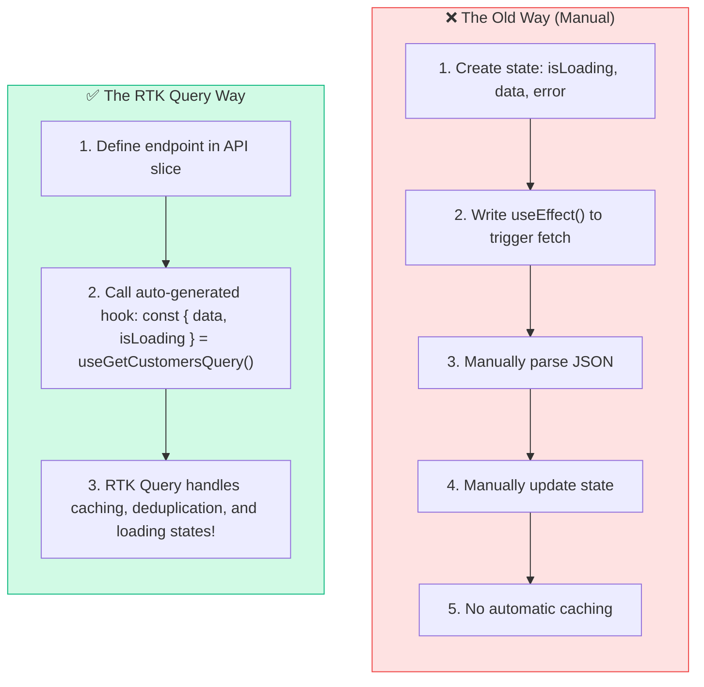
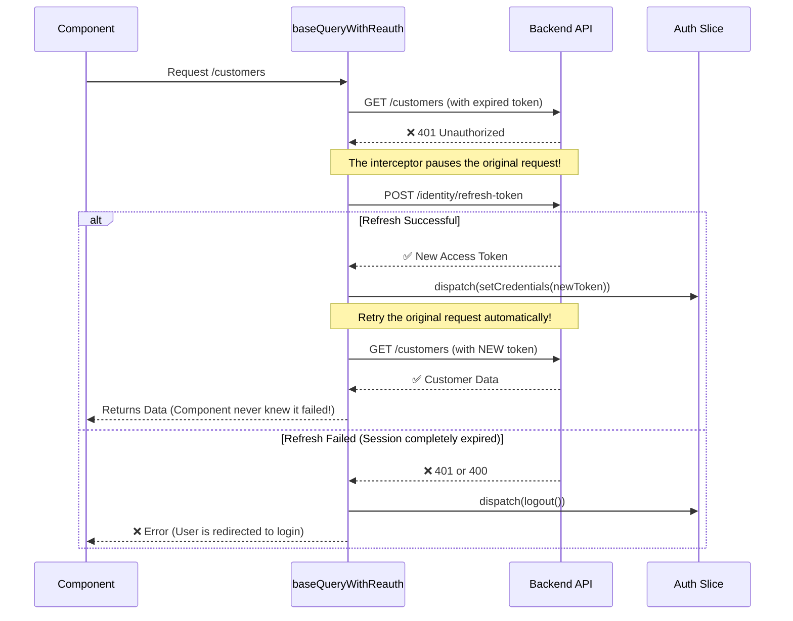

# ⚡ RTK Query & Token Rotation

> **Purpose**: This note explains **how our app talks to the backend**. It covers how we fetch data, how we automatically attach security headers, and the "magic" process of silently refreshing expired tokens so the user never gets abruptly logged out.

---

## 🤔 The Old Way vs The RTK Query Way

In the past, developers used `fetch()` or `axios` to get data from a backend. It was manual, repetitive, and required writing a lot of boilerplate code for loading spinners and error messages.

**RTK Query** is a powerful data fetching and caching tool built directly into Redux Toolkit.



### Why RTK Query is Enterprise-Grade:
1. **Caching**: If you fetch the customer list on Page A, then go to Page B, then back to Page A, RTK Query instantly shows the cached data instead of making a slow second request.
2. **Deduplication**: If 5 components on the same page request the user's profile, RTK Query only sends **one** request to the backend and shares the result with all 5 components.
3. **Auto-Refetching**: You can tell RTK Query "When a new customer is added, automatically refetch the customer list."

---

## 🏗️ The `baseApi.ts` Foundation

**File**: `shared/services/baseApi.ts`

Instead of creating separate Axios instances for every feature, we create **one central `baseApi`**. All features (customers, leads, deals) will "inject" their endpoints into this base.

### 1. Global Setup (`fetchBaseQuery`)

Think of `fetchBaseQuery` as a highly customized `fetch()` function that applies our rules to *every single request*.

```typescript
const API_BASE_URL = import.meta.env.VITE_API_URL || 'https://localhost:5001/api/v1';

const baseQuery = fetchBaseQuery({
  baseUrl: API_BASE_URL,
  prepareHeaders: (headers, { getState }) => {
    // 1. Get the current state from Redux
    const state = getState() as RootState;
    const token = state.auth.accessToken;
    const tenantId = state.auth.tenantId;

    // 2. Attach the JWT Token
    if (token) {
      headers.set('authorization', `Bearer ${token}`);
    }

    // 3. Attach the Tenant ID (for multi-tenant SaaS)
    if (tenantId) {
      headers.set('X-Tenant-Id', tenantId);
    }

    return headers;
  },
});
```

### What is happening here?
Every time *any* component makes an API call, `prepareHeaders` acts like a toll booth. It halts the request, reaches into our Redux Auth Slice (see [[02-Redux-State-Management]]), grabs the `accessToken` and `tenantId`, and stamps them onto the request headers. 

You **never** have to manually add tokens to your requests. It happens automatically.

---

## 🔄 The Magic of Token Rotation (Silent Refresh)

JWT Access Tokens are deliberately designed to be short-lived (e.g., they expire every 15 minutes) for security reasons.

**The Problem**: It would be terrible user experience if the user was kicked out to the login screen every 15 minutes!

**The Solution**: **Refresh Token Rotation**. When the user logs in, the backend gives us *two* tokens:
1. A short-lived **Access Token** (used for API calls).
2. A long-lived **Refresh Token** (usually stored securely in an HttpOnly cookie).

Our `baseQueryWithReauth` wrapper automates the refresh process:



### The Code Breakdown:

```typescript
const baseQueryWithReauth: BaseQueryFn<...> = async (args, api, extraOptions) => {
  // 1. Try the normal request first
  let result = await baseQuery(args, api, extraOptions);

  // 2. Did the backend say "401 Unauthorized"?
  if (result.error && result.error.status === 401) {
    
    // 3. Ask the backend for a new token silently
    const refreshResult = await baseQuery(
      { url: '/identity/refresh-token', method: 'POST' },
      api,
      extraOptions
    );

    if (refreshResult.data) {
      // 4. Success! Save the new token in Redux
      api.dispatch(setCredentials({ accessToken: refreshResult.data.accessToken, ... }));

      // 5. Retry the original request that failed in Step 1
      result = await baseQuery(args, api, extraOptions);
    } else {
      // 6. Refresh token is expired too. Force logout.
      api.dispatch(logout());
    }
  }

  // 7. Return the final result to the component
  return result;
};
```

---

## 🏷️ Tag Types and Cache Invalidation

At the bottom of `baseApi.ts`, we define the `baseApi` instance:

```typescript
export const baseApi = createApi({
  reducerPath: 'api',
  baseQuery: baseQueryWithReauth,
  tagTypes: ['User', 'Customer', 'Lead', 'Deal', 'Activity', 'Analytics'],
  endpoints: () => ({}), // Endpoints will be injected later
});
```

### What are `tagTypes`?
Tags are how RTK Query manages cache invalidation. 

Imagine this scenario:
1. You fetch a list of customers. RTK Query tags this data with `['Customer']` and caches it.
2. You navigate away, then navigate back. RTK Query shows the cached list instantly.
3. You submit a form to **add a new customer**.
4. The add customer mutation specifies that it **invalidates the `['Customer']` tag**.
5. RTK Query sees the invalidation, deletes the old cached list, and automatically fetches the fresh list in the background!

This completely eliminates the need to manually manage state arrays like `customers.push(newCustomer)`.

---

## 💉 Injecting Endpoints (Future Workflow)

Notice that `endpoints: () => ({})` is empty in `baseApi.ts`. 

We don't put all our API endpoints in one giant file. Instead, each feature folder will define its own endpoints and **inject** them into the base API.

Example of what we will do later in the `features/customers/api/` folder:

```typescript
// features/customers/api/customersApi.ts
import { baseApi } from '@shared/services/baseApi';

export const customersApi = baseApi.injectEndpoints({
  endpoints: (builder) => ({
    getCustomers: builder.query<Customer[], void>({
      query: () => '/customers',
      providesTags: ['Customer'], // Tags the cache
    }),
    addCustomer: builder.mutation<Customer, Partial<Customer>>({
      query: (newCustomer) => ({
        url: '/customers',
        method: 'POST',
        body: newCustomer,
      }),
      invalidatesTags: ['Customer'], // Busts the cache!
    }),
  }),
});

// RTK Query auto-generates hooks for us!
export const { useGetCustomersQuery, useAddCustomerMutation } = customersApi;
```

Then, inside a React component, fetching data is as simple as:

```tsx
const CustomersList = () => {
  // One line of code handles fetching, loading states, and caching!
  const { data: customers, isLoading, isError } = useGetCustomersQuery();

  if (isLoading) return <Spinner />;
  if (isError) return <Error />;

  return <ul>{customers.map(c => <li>{c.name}</li>)}</ul>;
}
```

---

## 🎯 Key Takeaways

| Concept | One-line Summary |
|---------|-----------------|
| **RTK Query** | Built-in Redux tool for declarative data fetching, caching, and auto-refetching. |
| **`fetchBaseQuery`** | A customizable wrapper around `fetch()` used by RTK Query. |
| **`prepareHeaders`** | Automatically attaches the JWT token and Tenant ID to every outgoing request. |
| **Refresh Token Rotation** | The process of automatically getting a new access token when the old one expires, without disrupting the user. |
| **`baseQueryWithReauth`** | Our custom interceptor that catches 401 errors, triggers the refresh, and retries the request. |
| **`tagTypes`** | Labels attached to cached data. Used to automatically trigger refetches when data changes. |
| **`injectEndpoints`** | Allows us to split our API definitions across different feature folders while sharing one central configuration. |

---

## 🔗 Related Notes

- ← [[00-Architecture-Overview]] — The master map of the whole frontend
- ← [[01-Authentication-&-Route-Guards]] — How the auth state (tokens) is managed
- ← [[02-Redux-State-Management]] — How the Redux store holds the API cache
- → [[04-UI-Theme-&-Design-System]] — How the UI theme is provided globally

---

> **Next**: Read [[04-UI-Theme-&-Design-System]] to understand how Material UI tokens define the visual look of the app. 🎨
