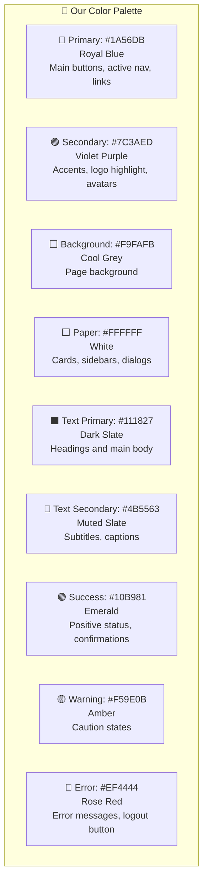
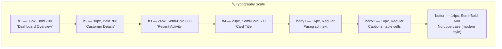
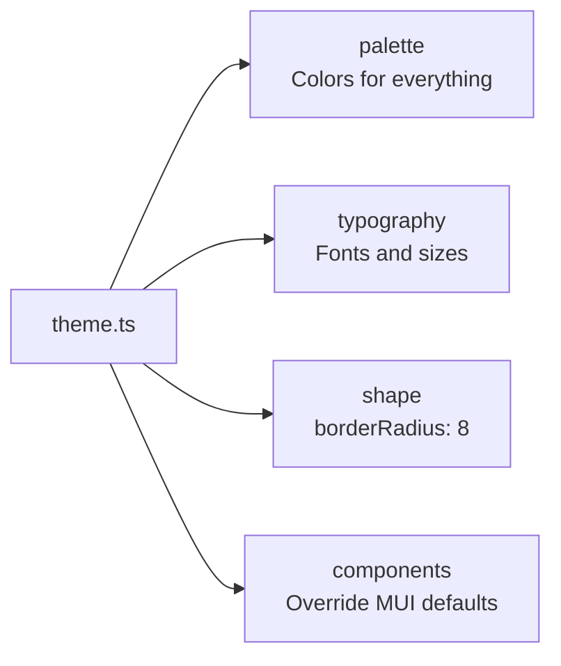
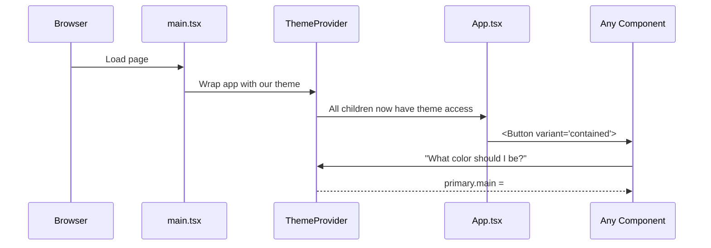
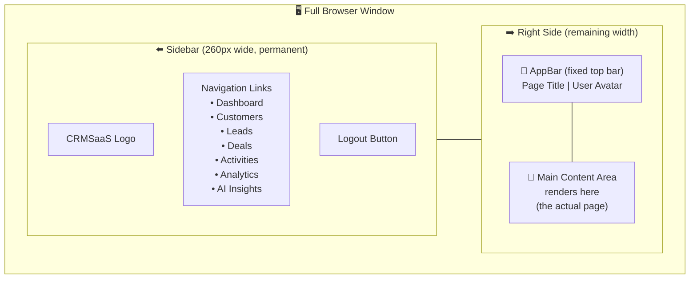
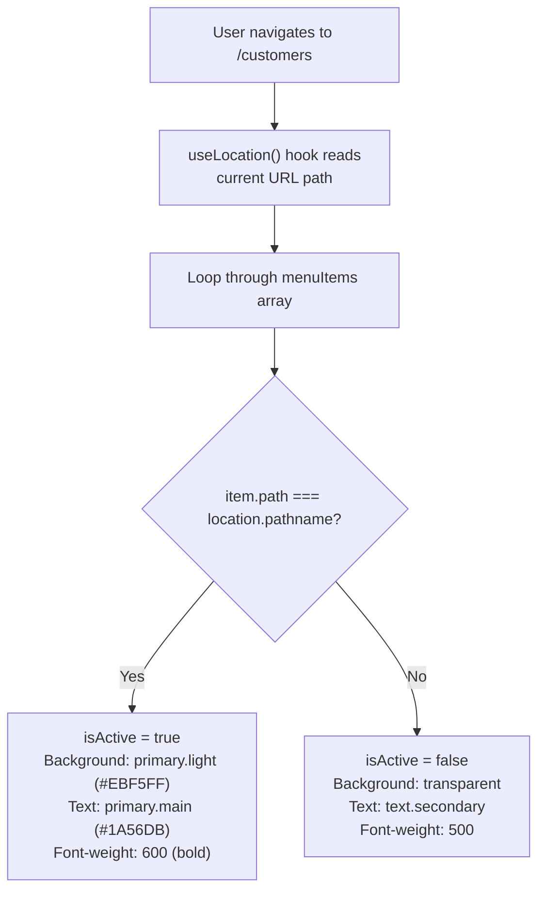
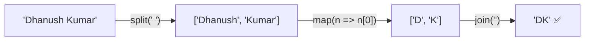
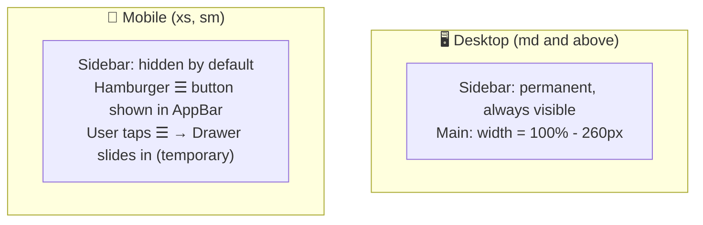
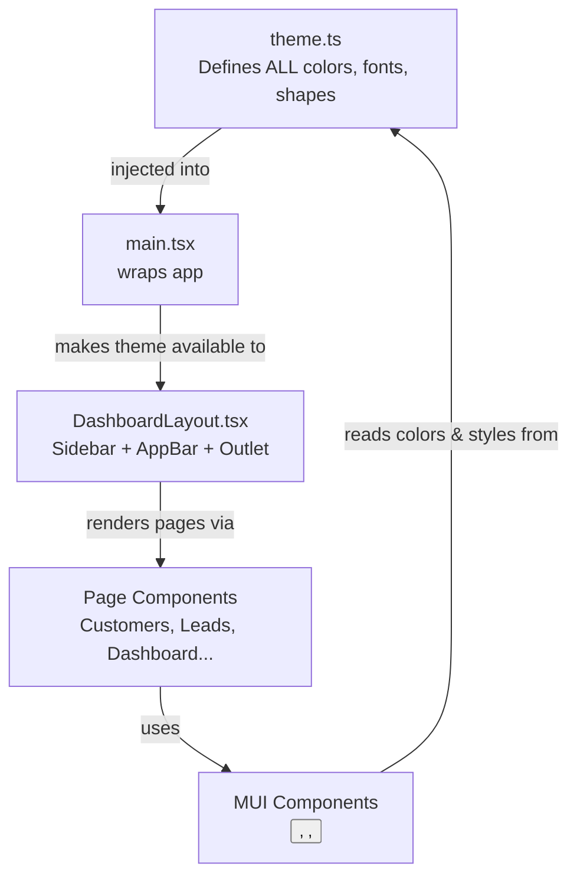

# 🎨 UI Theme & Design System

> **Purpose**: This note explains **how our app looks the way it does** — the color palette, fonts, spacing, component styles, and how the Dashboard Layout is structured. Think of this as the **style guide** of our entire app.

---

## 🤔 What Problem Are We Solving?

Without a design system, every developer styles things differently. One button is blue, another is navy, one has sharp corners, another is round. The result is a **messy, inconsistent UI**.

A design system solves this by defining **one source of truth** for every visual decision:

```
✅ Primary color is ALWAYS #1A56DB (Royal Blue)
✅ Border radius is ALWAYS 8px
✅ Font is ALWAYS "Inter"
✅ Button hover ALWAYS lifts up with a shadow
```

Our app uses **Material UI (MUI)** as the component library, and we customized it with our own `theme.ts` file to give it a premium, SaaS look.

---

## 🏗️ The Tool: Material UI (MUI)

**MUI** is a React component library. Think of it as a box of pre-built LEGO pieces — Buttons, Cards, Inputs, Sidebars, etc. — that you can assemble quickly.

```mermaid
flowchart LR
    A["🧱 Raw HTML\n<button>, <div>, <input>"] 
    B["🎨 MUI Components\n<Button>, <Card>, <TextField>"]
    C["✨ Our Themed MUI\nCustom colors, fonts, shadows"]

    A -->|"MUI wraps these"| B
    B -->|"theme.ts customizes"| C
```



**Without MUI**: You'd write hundreds of lines of CSS from scratch for every button, dialog, sidebar, and form.

**With MUI**: You use `<Button variant="contained">` and it already looks great. You just customize the colors once.

---

## 🎨 Our Color Palette

Our `theme.ts` defines a **premium, harmonious SaaS color palette**. Here is the full palette explained:



### Why These Colors?

| Color | Hex Code | Used For | Why? |
|-------|----------|----------|------|
| Royal Blue | `#1A56DB` | Buttons, active states | Trustworthy, professional — standard for SaaS apps |
| Violet | `#7C3AED` | Accents, logo | Adds a modern, tech feel without being overdone |
| Cool Grey | `#F9FAFB` | Page background | Softer than pure white, reduces eye strain |
| Dark Slate | `#111827` | Main text | Near-black — highly readable |
| Emerald | `#10B981` | Success states | Universally understood as "good" |

---

## 🔤 Typography System

Our font is **Inter** — a modern, clean font designed specifically for screen readability used by companies like Linear, Vercel, and Notion.



> **💡 Key Decision**: We set `textTransform: 'none'` on buttons. By default, MUI makes button text `ALL CAPS`. We removed this because modern SaaS apps (like Stripe and Linear) use sentence-case buttons — it looks cleaner and less shouty.

---

## 📦 The `theme.ts` File — Line by Line

Here is our actual `theme.ts` with every section explained:

```typescript
// 1. We import MUI's theme creator
import { createTheme } from '@mui/material/styles';

export const theme = createTheme({
  // ─────────────────────────────
  // SECTION 1: Color Palette
  // ─────────────────────────────
  palette: {
    mode: 'light',          // 'light' or 'dark' — we chose light for now
    primary: {
      main: '#1A56DB',      // The main royal blue — used on buttons, links
      light: '#EBF5FF',     // Pale blue — used for active nav item background
      dark: '#1E429F',      // Darker blue — used on hover
      contrastText: '#FFF', // Text ON the blue button must be white
    },
    secondary: {
      main: '#7C3AED',      // Violet — for accent elements
      light: '#F5F3FF',     // Pale violet
      dark: '#6D28D9',
      contrastText: '#FFF',
    },
    background: {
      default: '#F9FAFB',   // The grey page background
      paper: '#FFFFFF',     // White for cards and drawers
    },
    // ... success, warning, error follow same pattern
  },

  // ─────────────────────────────
  // SECTION 2: Typography
  // ─────────────────────────────
  typography: {
    fontFamily: '"Inter", "Roboto", "Helvetica", "Arial", sans-serif',
    // If Inter isn't loaded, falls back to Roboto, then Helvetica, then Arial
    button: {
      textTransform: 'none', // NO ALL CAPS on buttons
      fontWeight: 600,
    },
  },

  // ─────────────────────────────
  // SECTION 3: Shape
  // ─────────────────────────────
  shape: {
    borderRadius: 8, // All rounded corners = 8px by default
  },

  // ─────────────────────────────
  // SECTION 4: Component Overrides
  // ─────────────────────────────
  components: {
    MuiButton: {
      styleOverrides: {
        root: {
          boxShadow: 'none',       // Remove default shadow
          '&:hover': {
            transform: 'translateY(-1px)',   // Button lifts up on hover
            boxShadow: '0 4px 6px ...',     // Shadow appears on hover
          },
        },
      },
    },
    MuiCard: {
      styleOverrides: {
        root: {
          borderRadius: 12,            // Cards are slightly more rounded than default
          border: '1px solid #E5E7EB', // Subtle border
          boxShadow: '0 1px 3px ...',  // Very light shadow
        },
      },
    },
  },
});
```

### The 4 Sections Summary:



---

## 🏠 How the Theme Is Applied

The theme is applied **once** at the very top of our app in `main.tsx`, wrapping everything in a `ThemeProvider`:



```typescript
// main.tsx
<ThemeProvider theme={theme}>   {/* ← Our custom theme injected here */}
  <CssBaseline />               {/* ← Resets browser default CSS */}
  <Provider store={store}>
    <App />
  </Provider>
</ThemeProvider>
```

`CssBaseline` is MUI's CSS reset — it removes browser inconsistencies (default margins, paddings, font sizes that differ between Chrome, Firefox, Safari).

---

## 🖥️ The Dashboard Layout

The Dashboard Layout (`DashboardLayout.tsx`) is the **frame** that wraps every private page. It has 3 parts:



### The 3 Parts Explained:

| Part | Component | What It Does |
|------|-----------|-------------|
| **Sidebar** | `<Drawer variant="permanent">` | Always visible on desktop. Shows navigation links. 260px wide. |
| **Top Bar** | `<AppBar position="fixed">` | Sticks to the top. Shows current page name + user avatar. |
| **Content** | `<Box component="main">` + `<Outlet />` | Where actual page content renders. React Router's `<Outlet />` swaps the page here. |

---

## 🧭 Navigation — Active State Logic

When you click "Customers", the sidebar highlights that item in blue. Here is how that works:



The key code is just one line:
```typescript
const isActive = location.pathname === item.path;
// true if we're on this page, false otherwise
```

---

## 👤 User Avatar Logic

In the top-right corner, you see a purple circle with initials. Here is how the initials are generated:

```typescript
// user.fullName = "Dhanush Kumar"
user?.fullName?.split(' ')       // → ["Dhanush", "Kumar"]
              .map((n) => n[0])   // → ["D", "K"]
              .join('')           // → "DK"
```



---

## 📱 Responsive Design (Mobile vs Desktop)

Our layout changes on small screens (phones/tablets):



MUI's `sx` prop with breakpoints handles this:
```typescript
// Show hamburger ONLY on mobile, hide on desktop:
sx={{ display: { xs: 'block', md: 'none' } }}

// Sidebar: permanent on desktop only:
sx={{ display: { xs: 'none', md: 'block' } }}
```

| Breakpoint | Screen Size | Sidebar Behaviour |
|------------|-------------|-------------------|
| `xs` | 0px+ (phones) | Hidden, slides in on tap |
| `sm` | 600px+ (landscape phones) | Hidden, slides in on tap |
| `md` | 900px+ (tablets, laptops) | Always visible (permanent) |

---

## 🔗 How Everything Connects



---

## 🧩 How To Add a New Nav Item

When you add a new feature (e.g., "Reports"), just add one object to the `menuItems` array:

```typescript
// In DashboardLayout.tsx
const menuItems = [
  { text: 'Dashboard',  icon: <DashboardIcon />, path: '/' },
  { text: 'Customers',  icon: <PeopleIcon />,    path: '/customers' },
  // ... existing items ...
  
  // 👇 Just add this line!
  { text: 'Reports', icon: <BarChartIcon />, path: '/reports' },
];
```

The sidebar will automatically render it, handle active state, and navigate to `/reports` on click. No other code changes needed in the layout.

---

## 📝 Quick Reference Cheat Sheet

| What | Value | Where defined |
|------|-------|---------------|
| Primary color | `#1A56DB` | `theme.ts → palette.primary.main` |
| Accent color | `#7C3AED` | `theme.ts → palette.secondary.main` |
| Background | `#F9FAFB` | `theme.ts → palette.background.default` |
| Font | Inter | `theme.ts → typography.fontFamily` |
| Border radius | 8px (cards: 12px) | `theme.ts → shape.borderRadius` |
| Sidebar width | 260px | `DashboardLayout.tsx → DRAWER_WIDTH` |
| Button hover effect | Lifts up + shadow | `theme.ts → MuiButton overrides` |
| Buttons ALL CAPS? | ❌ No | `theme.ts → button.textTransform: 'none'` |

---

## 🔗 Related Notes

- [[00-Architecture-Overview]] — The big picture of the whole frontend
- [[01-Authentication-&-Route-Guards]] — How ProtectedRoute wraps DashboardLayout
- [[02-Redux-State-Management]] — How `useSelector` gets user data for the Avatar
- [[03-RTK-Query-&-Token-Rotation]] — How API calls fetch data for the pages inside Outlet
